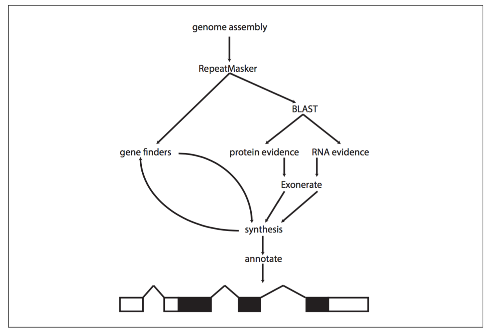

## Pipeline description for protein-coding gene annotation.

:loudspeaker: Designed specifically for arthropods.

## Table of contents

1. [Required files](#1_required)
	* [Final genome](#11_genome)
	* [Busco](#12_busco)
	* [RNA evidence](#13_transcriptome)	
	* [Proteine evidence](#14_protein)

2. [Structural annotation](#2_structural)

3. [Functional annotation](#3_functional)

## <a name="1_required"></a>1) Required files 

#### <a name="11_genome"></a>1.1) Final genome

- Decontaminated.

- Organized as discussed (sorted by decreasing length + header renamed).


#### <a name="12_busco"></a>1.2) Busco (Long)

For [Busco](http://busco.ezlab.org/), the database `arthropoda` has been used for mites and ostracods and `insecta` for timemas.

```
source /scratch/beegfs/monthly/ptranvan/Software/busco/3.0.2b.sh

run_BUSCO.py --long -i 2_Sm_b1v01.fasta -o output -l /scratch/beegfs/monthly/ptranvan/Software/busco/3.0.2b/arthropoda_odb9 -m geno -c 10
```

Pay attention to the `--long` option that improve BUSCO's results accuracy.

See: https://gitlab.com/ezlab/busco/issues/29


#### <a name="13_transcriptome"></a>1.3) Transcriptome evidence

For the transcriptome, I have chosen [STAR](https://github.com/alexdobin/STAR) for mapping and [Trinity genome guided](https://github.com/trinityrnaseq/trinityrnaseq/wiki/Genome-Guided-Trinity-Transcriptome-Assembly) for the assembly. 

1) Map your reads with STAR

```
module add UHTS/Aligner/STAR/2.5.3a;

# Index creation
 
mkdir index
STAR --runMode genomeGenerate --genomeDir index --genomeFastaFiles genome.fasta --runThreadN 15

# Mapping step (for PE)

mkdir 2pass_basic

STAR --genomeDir ../index/ --readFilesIn a.pair1.fastq.gz,b.pair1.fastq.gz a.pair2.fastq.gz,b.pair2.fastq.gz --runThreadN 10 --outSAMtype BAM SortedByCoordinate --twopassMode Basic --readFilesCommand zcat --limitBAMsortRAM 8051268437 --outFileNamePrefix 2pass_basic/out.

# Mapping step (for SE)

mkdir 2pass_basic

STAR --genomeDir ../index/ --readFilesIn a.fastq.gz,b.fastq.gz,c.fastq.gz --runThreadN 10 --outSAMtype BAM SortedByCoordinate --twopassMode Basic --readFilesCommand zcat --limitBAMsortRAM 8051268437 --outFileNamePrefix 2pass_basic/out.
```

:heavy_exclamation_mark: For `timema`, we have a mix of PE and SE. Since STAR and Trinity cannot mix these 2 kind of libraries, I had to convert PE into single reads. The R2 reads (dev data) have been reversed-complemented before the STAR step.

```
/scratch/beegfs/monthly/ptranvan/Software/seqkit/seqkit seq -r -p /scratch/beegfs/monthly/dparker/Timema_RNA_reads_Trimmed/Dev/Tcm_F_J_rep1_JCmF01_R2_qtrimmed.fq.gz -j 3 | gzip -c  > Tcm_F_J_rep1_JCmF01_R2_qtrimmed.rc.fq.gz
```

:link: Source:

* Strategy for SE and PE: https://github.com/trinityrnaseq/trinityrnaseq/issues/336

* Benchmark for RNA mapper:

:page_facing_up: Baruzzo *et al*. Simulation-based comprehensive benchmarking of RNA-seq aligners. Nature Methods. 2017

:page_facing_up: Engström *et al*. Systematic evaluation of spliced alignment programs for RNA-seq data. Nature Methods. 2013

:page_facing_up: http://genomespot.blogspot.ch/2015/03/hisat-vs-star-vs-tophat2-vs-olego-vs.html

2) Assembly with Trinity (genome guided method)

```
module add UHTS/Assembler/trinityrnaseq/2.4.0; #timema

module add UHTS/Assembler/trinityrnaseq/2.5.1; # mite and ostracod

# out.Aligned.sortedByCoord.out.bam done by STAR.

# For PE:
 
Trinity --genome_guided_bam out.Aligned.sortedByCoord.out.bam --genome_guided_max_intron 100000 --max_memory 200G --CPU 35 --SS_lib_type RF --jaccard_clip 

# For SE:

Trinity --genome_guided_bam out.Aligned.sortedByCoord.out.bam --genome_guided_max_intron 100000 --max_memory 200G --CPU 35 --SS_lib_type R
```

:link: Why Trinity ?

1. Trinity is recommended by Maker developer. https://groups.google.com/forum/#!topic/maker-devel/pJBCxBnxksU

2. It can handle high gene density issue (with `--jaccard_clip` option)

:page_facing_up: Yandell, Ence. A beginner's guide to eukaryotic genome annotation. Nat Rev Genet. 2012

- Max intron parameter for arthropods and insects: https://github.com/trinityrnaseq/trinityrnaseq/issues/291


3) Filter the transcriptome

I have followed the Trinity developers recommendation:

:page_facing_up: https://github.com/trinityrnaseq/trinityrnaseq/wiki/Trinity-FAQ#ques_why_so_many_transcripts

:page_facing_up: https://github.com/trinityrnaseq/trinityrnaseq/wiki/Trinity-Transcript-Quantification

a) Map all samples against transcriptome and compute the TMP value per sample per contig.

b) Keep contigs that have at least 1 TPM in any sample.

For the TMP value computation, I have used Kallisto:

```
module add UHTS/Analysis/kallisto/0.43.0 #timema

module add UHTS/Analysis/kallisto/0.43.1 #mite and ostracod

# For PE:
 
kallisto quant -i ../index/2_Tcm_b3v06_Tv01 -t 10 --rf-stranded --bias -o kallisto/Tcm_p Tcm_R1.fq.gz Tcm_R2.fq.gz

# For SE:

kallisto quant -i ../index/2_Tcm_b3v06_Tv01 -t 10 --single -l 200 -s 20 --rf-stranded --bias -o kallisto/Tcm_s Tcm_s.fq.gz
```

The transcriptome filtered is `2_Tcm_b3v06_Tv02`.

#### <a name="14_protein"></a>1.4) Protein evidence

- UniProtKB/Swiss-Prot + Busco arthropoda for `mites` and `ostracods`.

```
cat /scratch/beegfs/monthly/ptranvan/database/uniprot_sprot/uniprot_sprot.fasta /scratch/beegfs/monthly/ptranvan/Software/busco/3.0.2b/arthropoda_odb9/ancestral_variants > uniprot_sprot_arthropoda.fasta
```

- UniProtKB/Swiss-Prot + Busco insecta for `timemas`. 

```
cat /scratch/beegfs/monthly/ptranvan/database/uniprot_sprot/uniprot_sprot.fasta /scratch/beegfs/monthly/ptranvan/Software/busco/3.0.2b/insecta_odb9/ancestral_variants > uniprot_sprot_insecta.fasta
```

## <a name="2_structural"></a>2) Structural annotation 

I am using [MAKER](http://www.yandell-lab.org/software/maker.html).

This pipeline is supported by Maker developer: https://groups.google.com/forum/#!topic/maker-devel/3pSGtIlAbmk

:link: Some resources that helped me:

:page_facing_up: Yandell, Ence. A beginner's guide to eukaryotic genome annotation. Nat Rev Genet. 2012

:page_facing_up: Campbell *et al*. Genome Annotation and Curation Using MAKER and MAKER-P. Curr Protoc Bioinformatics. 2014

:page_facing_up: http://weatherby.genetics.utah.edu/MAKER/wiki/index.php/MAKER_Tutorial_for_GMOD_Online_Training_2014

:page_facing_up: https://github.com/jeffdacosta/MaleaeGenomics/tree/master/Genome-Annotation

:page_facing_up: https://scilifelab.github.io/courses/annotation/2016/schedule

MAKER works in an iterative way: it will be run several times (2 rounds also called two-pass interation) to improve gene prediction. 




Set the environment (Only for Vital-IT):

```
export PATH=/scratch/beegfs/monthly/ptranvan/Software/mpich-3.2/mpi_install/bin:/scratch/beegfs/monthly/ptranvan/Software/maker_7_local/bin:/software/SequenceAnalysis/GenePrediction/snoscan/0.9.1/bin:/software/SequenceAnalysis/GenePrediction/tRNAscan-SE/2.0.0/bin:/software/SequenceAnalysis/GenePrediction/augustus/3.2.3/scripts:/software/SequenceAnalysis/GenePrediction/augustus/3.2.3/bin:/scratch/beegfs/monthly/ptranvan/Software/RepeatMasker/4.0.7_local:/software/Blast/ncbi-blast/2.7.1+/bin:/software/SequenceAnalysis/Repeat/trf/4.07b/bin:/software/SequenceAnalysis/HMM-Profile/hmmer/3.1b2/bin:/software/SequenceAnalysis/Repeat/RMBlast/2.6.0+/bin:/software/UHTS/Aligner/phrap/0.990329/bin:/software/SequenceAnalysis/SequenceAlignment/exonerate/2.4.0/bin:/software/SequenceAnalysis/GenePrediction/snap/2013.11.29/bin:/home/ptranvan/qiime/bin/:/home/ptranvan/qiime/bin/:/mnt/common/lsf/9.1/linux2.6-glibc2.3-x86_64/etc:/mnt/common/lsf/9.1/linux2.6-glibc2.3-x86_64/bin:/software/bin:/usr/local/bin:/usr/bin:/usr/local/sbin:/usr/sbin:/scratch/beegfs/monthly/ptranvan/Software/assemblathon/1.0:/home/ptranvan/bin:/scratch/beegfs/monthly/ptranvan/Software/assemblathon/1.0

export AUGUSTUS_CONFIG_PATH=/scratch/beegfs/monthly/ptranvan/Software/busco/3.0.2b/augustus_config_7
```

#### <a name="21_round1"></a>2.1) Iteration 1


1) Create and modify control files

```
mkdir maker
cd maker

maker -CTL
```

Parameter to change:

- In `maker_bopts.ctl`:

```
depth_blastn=10
depth_blastx=10
depth_tblastx=10
```

- In `maker_opts.ctl`:

```
genome=../2_Tcm_b3v06.fasta
est=../evidence/2_Tcm_b3v06_Tv02.fasta
protein=../evidence/uniprot_sprot_insecta.fasta

augustus_species=BUSCO_2_Tcm_b3v06_1776195510
est2genome=1
protein2genome=1

max_dna_len=300000
alt_splice=1
split_hit=100000
correct_est_fusion=1
```
 
3) Run Maker

```
mpiexec -n 20 maker
```

Once finished:

```
gff3_merge -d 2_Tcm_b3v06.maker.output/2_Tcm_b3v06_master_datastore_index.log

mv maker_opts.ctl maker_opts_round1.ctl
mv 2_Tcm_b3v06.all.gff 2_Tcm_b3v06.all.round1.gff
cp maker_opts_round1.ctl maker_opts.ctl
```

#### <a name="22_round2"></a>2.2) Iteration 2


1) Train Maker result from iteration 1 with SNAP

```
mkdir -p snap/round1
cd snap/round1

maker2zff ../../maker/2_Tcm_b3v06.all.round1.gff 

fathom genome.ann genome.dna -categorize 1000
fathom -export 1000 -plus uni.ann uni.dna
forge export.ann export.dna

hmm-assembler.pl 2_Tcm_b3v06 . > 2_Tcm_b3v06.maker_round1_snap.hmm
```

2) Train Maker result from iteration 1 with Augustus

```
export PATH=/scratch/beegfs/monthly/ptranvan/Software/augustus/3.2.3/scripts:$PATH
export PATH=/scratch/beegfs/monthly/ptranvan/Software/augustus/3.2.3/bin:$PATH

export AUGUSTUS_CONFIG_PATH=/scratch/beegfs/monthly/ptranvan/Software/augustus/3.2.3/config
module add SequenceAnalysis/blat/36;

mkdir augustus

autoAug.pl --genome=../snap/round1/export.dna --species=AUGUSTUS_2_Tcm_b3v06_round1 --trainingset=../snap/round1/export.aa --singleCPU -v --useexisting > output.log

# copy /config/specie/AUGUSTUS_2_Tcm_b3v06_round1 to $AUGUSTUS_CONFIG_PATH/specie
```

2) Modify control files

Parameter to change:

- In `maker_opts.ctl`:

```
snaphmm=../snap/round1/2_Tcm_b3v06.maker_round1_snap.hmm
augustus_species=AUGUSTUS_2_Tcm_b3v06_round1
est2genome=0
protein2genome=0
```
 
3) Run Maker

```
mpiexec -n 20 maker
```

Once finished:

```
gff3_merge -d 2_Tcm_b3v06.maker.output/2_Tcm_b3v06_master_datastore_index.log

mv maker_opts.ctl maker_opts_round2.ctl
mv 2_Tcm_b3v06.all.gff 2_Tcm_b3v06.all.round2.gff
cp maker_opts_round2.ctl maker_opts.ctl
```

## <a name="3_functional"></a>3) Functional annotation 


1) Create GFF file and a separate max file with lines containing annotation information
 
```  
mkdir functional
cd functional

awk '/\tmaker\t/' ../2_Tcm_b3v06.all.round2.gff > 2_Tcm_b3v06.max.gff
   
```    
    
2) Create protein and transcript fasta files
  
```    
fasta_merge -d ../2_Tcm_b3v06.maker.output/2_Tcm_b3v06_master_datastore_index.log

cp 2_Tcm_b3v06.all.maker.proteins.fasta 2_Tcm_b3v06.max.proteins.fasta
cp 2_Tcm_b3v06.all.maker.transcripts.fasta 2_Tcm_b3v06.max.transcripts.fasta
``` 

3) Assign short names to each annotation

``` 
maker_map_ids --prefix TCM_ --justify 5 2_Tcm_b3v06.max.gff > 2_Tcm_b3v06.max.map
    
map_gff_ids 2_Tcm_b3v06.max.map 2_Tcm_b3v06.max.gff
map_fasta_ids 2_Tcm_b3v06.max.map 2_Tcm_b3v06.max.proteins.fasta
map_fasta_ids 2_Tcm_b3v06.max.map 2_Tcm_b3v06.max.transcripts.fasta
``` 

4) Assign gene functions against UniProtKB/Swiss-Prot database

```
module add Blast/ncbi-blast/2.7.1+;
 
makeblastdb -in /scratch/beegfs/monthly/ptranvan/database/uniprot_sprot/uniprot_sprot.fasta -input_type fasta -dbtype prot -out uniprot_sprot
     
blastp -db /scratch/beegfs/monthly/ptranvan/database/uniprot_sprot/db_blast/uniprot_sprot -query 2_Tcm_b3v06.max.proteins.fasta -out 2_Tcm_b3v06.max.proteins.blastp -evalue 0.000001 -outfmt 6 -num_alignments 1 -seg yes -soft_masking true -lcase_masking -max_hsps 1 -num_threads 20
```

5) Add blast function on GFF and fasta files.
 
```
maker_functional_gff /scratch/beegfs/monthly/ptranvan/database/uniprot_sprot/uniprot_sprot.fasta 2_Tcm_b3v06.max.proteins.blastp 2_Tcm_b3v06.max.gff > 2_Tcm_b3v06.max.func.gff   

maker_functional_fasta /scratch/beegfs/monthly/ptranvan/database/uniprot_sprot/uniprot_sprot.fasta 2_Tcm_b3v06.max.proteins.blastp 2_Tcm_b3v06.max.proteins.fasta > 2_Tcm_b3v06.max.proteins.func.fasta

maker_functional_fasta /scratch/beegfs/monthly/ptranvan/database/uniprot_sprot/uniprot_sprot.fasta 2_Tcm_b3v06.max.proteins.blastp 2_Tcm_b3v06.max.transcripts.fasta > 2_Tcm_b3v06.max.transcripts.func.fasta
```   

6) Assign domains (Pfam, IPR etc.) and GO functions to annotations

```
mkdir interproscan
cd  interproscan
 
source /scratch/beegfs/monthly/ptranvan/Software/interproscan/5.29-68.0.sh 

interproscan.sh -iprlookup -goterms -f tsv -cpu 20 -T /scratch/beegfs/weekly/ptranvan/ -i ../2_Tcm_b3v06.max.proteins.func.fasta
```   

7) Add these functions on GFF

```
ipr_update_gff 2_Tcm_b3v06.max.func.gff interproscan/2_Tcm_b3v06.max.proteins.func.fasta.tsv > 2_Tcm_b3v06.max.func.ipr.gff
```


